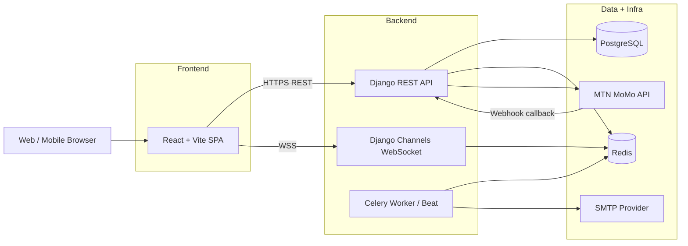

# Real Estate Booking Platform

End-to-end property booking platform with a React frontend and Django backend, supporting:

- User authentication and account management
- Listing discovery, booking, and reviews
- Host workflows (listing creation, host dashboard)
- Payments (MTN MoMo flow)
- Real-time messaging and notifications
- Admin and reporting capabilities

## Platform Overview

This repository contains three core layers:

- Frontend app (React + TypeScript + Vite)
- Backend services (Django + DRF + Channels + Celery)
- Documentation and operational runbooks

Primary service domains in the backend:

- authapp: registration, login, token lifecycle, email verification, password reset
- users: profile and dashboard endpoints
- listings: properties, favorites, reviews, analytics
- bookings: booking creation, cancellation, and booking utilities
- payments: payment initiation, verification, webhooks, refunds
- messaging: conversations, direct messaging, unread counts
- notifications: in-app and email notifications
- reports: reporting and admin insights
- suspensions: account enforcement and middleware checks

## Architecture Diagram



## Service Interaction Summary

- Authentication: JWT access/refresh tokens with guarded host/admin routes
- API state: frontend consumes typed API services and server-backed query hooks
- Real-time: chat and notifications over WebSocket via Channels
- Async jobs: notification email delivery and background workflows via Celery
- Payments: request-to-pay flow with webhook/poll-based status reconciliation

## Repository Layout

```text
realestate-booking-platform/
	backend/        Django backend services
	frontend/       React frontend application
	docs/           Integration + infrastructure documentation
	testing/        Testing guides and test assets
```

## Quick Start (Local)

1. Backend

```bash
cd backend
python -m venv .venv
source .venv/bin/activate   # Windows: .venv\Scripts\activate
pip install -r requirements.txt
cp .env.example .env
python manage.py migrate
python manage.py createcachetable
python manage.py runserver
```

2. Frontend

```bash
cd frontend
npm install
npm run dev
```

Frontend default: http://localhost:5173  
Backend default: http://localhost:8000

## Deployment and Infrastructure Docs

- Integration guide: [docs/integration.md](docs/integration.md)
- Backend production infrastructure: [docs/backend/infrastructure-production.md](docs/backend/infrastructure-production.md)
- Frontend production infrastructure: [docs/frontend/infrastructure-production.md](docs/frontend/infrastructure-production.md)

## Pre-Release Gate

Run the unified release checks from repository root:

```bash
bash scripts/release-check.sh
```

For local dry-runs:

```bash
bash scripts/release-check.sh --allow-dev
```

Deploy only when release checks report zero failures.